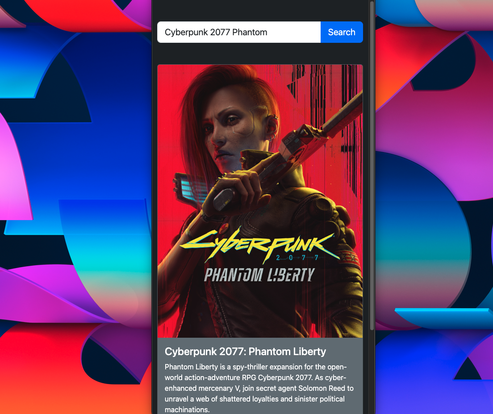
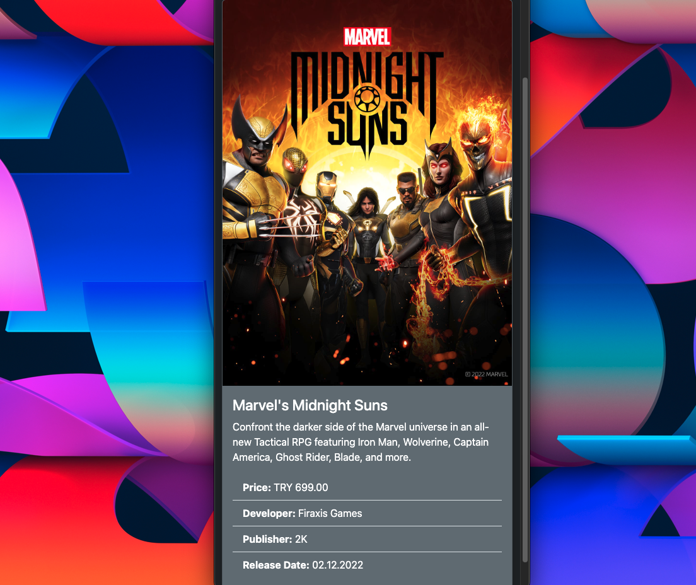
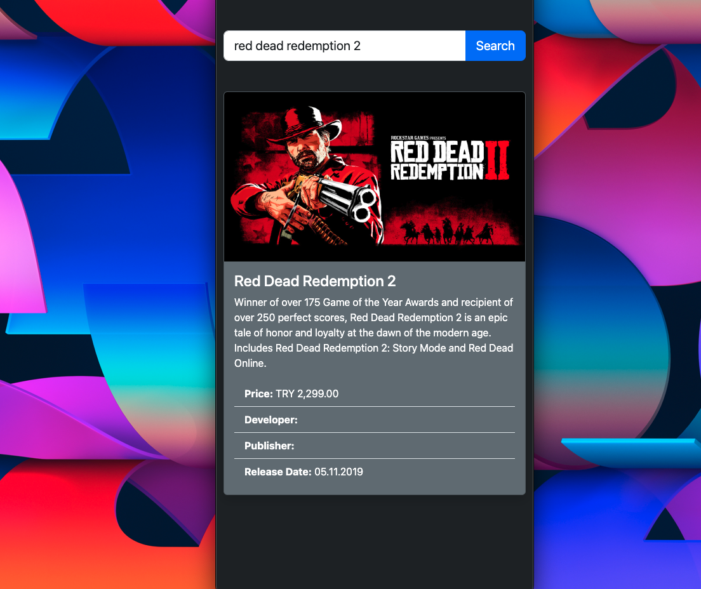
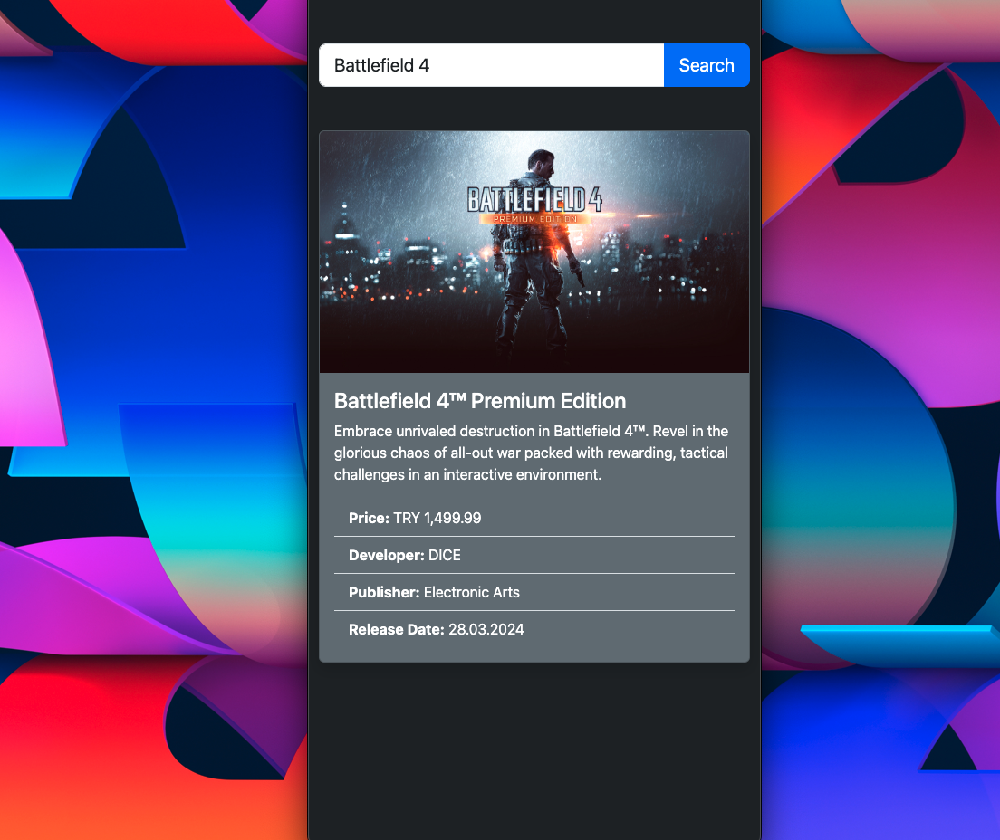

# 🎮 Fiyat Hunter

Fiyat Hunter is a lightweight Go-based API that fetches game data from **Epic Games** and displays it in a simple Bootstrap UI.

## 🧪 Features

- RESTful API built with **Go (Gin)**
- Fetches game data from Epic Games
- Clean Bootstrap frontend UI
- Query games with `/game/:name` endpoint
- Supports CORS for local development

## 🚀 Usage

```
$ go run main.go
// or
$ go run .
```

**🖼️ Screenshots**

### 🎮 Cyberpunk 2077


---

### 🦸 Marvel's Midnight Suns


---

### 🤠 Red Dead Redemption 2


---

### ⚔️ Battlefield 4
